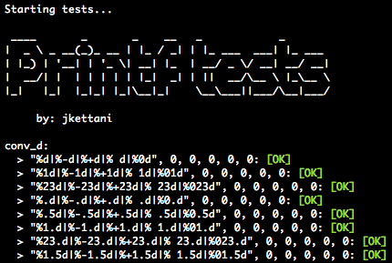

# Printf unit test

Collection of unit tests for the project *ft_printf* at [42](https://www.42.fr/).
All the tests are stored in a single *tests.txt* file and automatically created by a script, so you can add your own tests to the existing ones.


## Getting started

```
git clone https://github.com/jkgithubrep/42_printf_unit_tests.git
```

## Usage
### Content

The repository contains three main folders:
- **framework**: contains all the files necessary to create the *libunit.a* library used to load and launch the different tests;
- **templates**: contains the different templated files used to automatically generate the tests;
- **tests**: contains all the tests seperated in different folders (ex: *conv_d* for the `%d` conversion specifier, *conv_f* for the `%f` conversion specifier, etc...), the *generator.sh* script to automate the test creation, the *tests.txt* file which contains all the tests and the *Makefile* to compile the tests.
```
.
├── README.md
├── framework
├── templates
└── tests
```

### Basic usage
1) `cd tests`
2) Change the path to your ft_printf project at the top of the Makefile  

3) `make test`

*> Output:*  



Each time you launch the tests a _**trace.txt**_ file containing the output of the tests is automatically created, so that you can compare the output of your ft_printf with the one of the stdio library.  


### Advanced usage

All the tests are stored in the _**tests.txt**_ file in the *tests* folder with the following format:
`type;name_of_the_test;arguments`  
Each line should correspond to a specific test, whose file will be automatically created.

Example:  
```
conv_d;random_int;"%d", 42
conv_d;random_int_with_various_flags;"%+24.5d|%-24.5d|%+024.5d", 42, 42, 42
mix;basic_mix;"char: %c, double: %f, string: %s", 't', 0.1, "this is a string"
...
```

To generate the test, use the _**./generator.sh**_ script as described below: 
```
Usage: ./generator.sh [action] [type]
   > actions:
       - create                  Create tests.
       - update                  Update tests (add new ones).
       - clean                   Clean tests.
   > type:
       - all                     All tests are affected.
       - mandatory               All mandatory tests (cspdiouxXf) are affected.
       - types                   Only named types after action keyword are affected.
```
Example:
- ` ./generator.sh create conv_d conv_f`  will create all the tests for the `conv_d`  and `conv_f` types.
- `./generator.sh create all` will create all the tests for all the types in the *tests.txt* file.
- `./generator.sh create mandatory` will create all the mandatory tests (mandatory part of the *ft_printf* project).

You can also update a specific type by using the `update` keyword instead of `create` if you added more tests.  

The `clean` keyword will save the folder containing the tests in a backup folder and then remove it.

## Issues

If you encounter any issue, you can contact me on slack (jkettani) or by email: jkettani@student.42.fr


## Author

by **jkettani**
